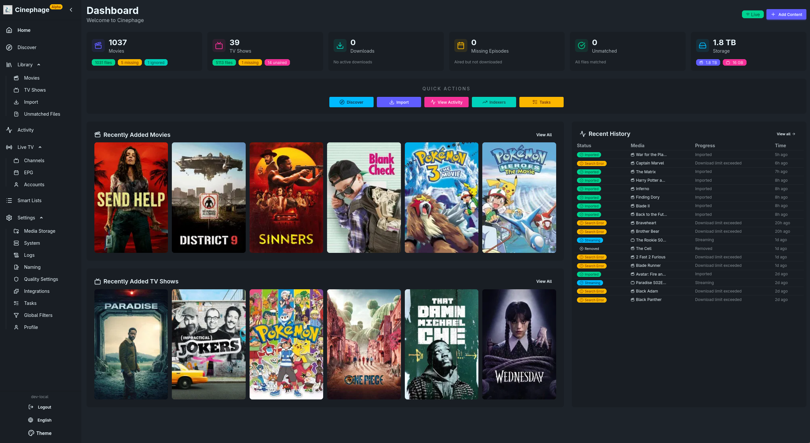
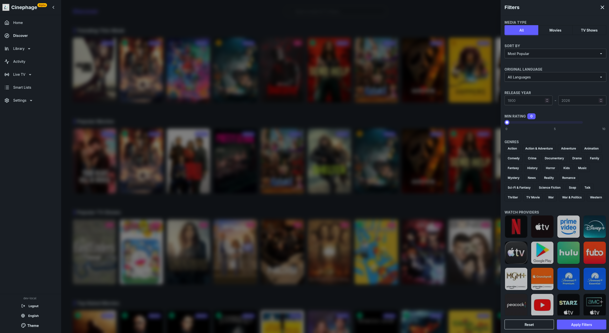
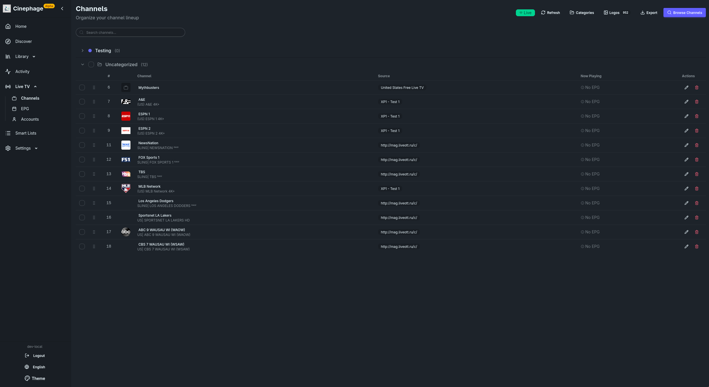
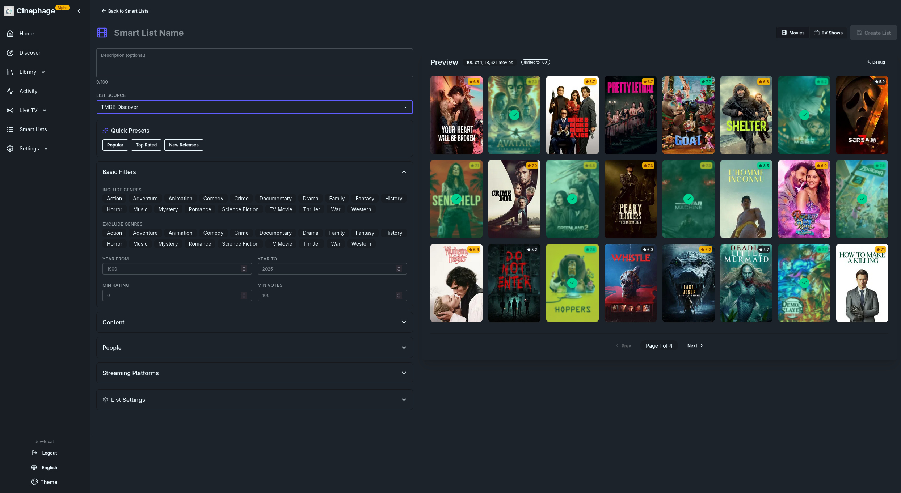

<p align="center">
  
</p>

<h1 align="center">Cinephage</h1>

<p align="center">
  <strong>Self-hosted media management. Everything in one app.</strong><br>
  <em>One app that actually replaces your entire media stack</em><br>
  <sub>Node.js 22+ · Svelte 5 · SQLite · TypeScript</sub>
</p>

<p align="center">
  <a href="https://github.com/MoldyTaint/Cinephage/releases"></a>
  <a href="https://github.com/MoldyTaint/Cinephage/actions"></a>
  <a href="https://github.com/MoldyTaint/Cinephage/blob/main/LICENSE"></a>
  <a href="https://discord.gg/scGCBTSWEt"></a>
</p>

<p align="center">
  <em>Cinephage</em> — from Greek <em>cine</em> (film) + <em>phage</em> (to devour). A film devourer.
</p>

<p align="center">
  <a href="#what-is-cinephage">What is Cinephage</a> •
  <a href="#quick-start">Quick Start</a> •
  <a href="#documentation">Documentation</a> •
  <a href="#community">Community</a>
</p>

---

<table>
  <tr>
    <td></td>
    <td></td>
  </tr>
  <tr>
    <td></td>
    <td></td>
  </tr>
</table>

---

## What is Cinephage?

Cinephage is a single app for your whole media setup. Instead of running multiple services that don't talk to each other, you get one tool that handles everything.

**One database.** All your movies, TV shows, live TV channels, subtitles, and indexer configs live together. No sync issues, everything stays together.

**One interface.** Browse, search, monitor, and manage everything from a single UI that works on desktop and mobile.

**One configuration.** Set up your indexers, download clients, and preferences once. They work across movies, TV, and streaming.

**One place.** Whether you're downloading a BluRay remux, streaming via .strm files, or watching live TV, it's all in Cinephage.

---

## What It Replaces

Cinephage brings together functionality you'd typically find across multiple applications:

- **Radarr & Sonarr** — Movie and TV series management
- **Prowlarr** — Indexer management with supported trackers
- **Bazarr** — Multi-provider subtitle management
- **Overseerr** — Content discovery and smart lists
- **FlareSolverr** — Built-in Cloudflare bypass (no external service needed)
- **Plus** — Live TV/IPTV management, usenet streaming, and more

The \*arr projects are fantastic at what they do. We just took a different path — one unified codebase instead of separate services that need to sync with each other.

---

## Key Features

### Stream without downloading

Create `.strm` files that point to online sources and watch instantly. No disk space, no waiting for downloads, no seeding. Works with Jellyfin, Emby, Kodi, or any player that supports .strm files.

### Built-in Cloudflare bypass

Camoufox integration handles Cloudflare challenges automatically. No separate FlareSolverr container to maintain, no configuration headaches. It just works.

### Usenet streaming

Stream directly from NZBs without downloading the entire file first. Unique seekable stream implementation with adaptive prefetching and segment caching.

### Live TV with portal discovery

Connect Stalker portals and automatically discover working MAC addresses. Full EPG support, channel management, and HLS streaming.

### Smart quality scoring

50+ scoring factors including codec efficiency (x265/AV1), HDR formats, audio quality, and release group reputation. Custom format creation for personalized scoring rules.

### Smart lists

Dynamic content discovery with auto-add to library. Import from IMDb, Trakt, TMDb lists, or create custom queries. "Automatically add all 2024 movies rated 7.5+" — fully automated.

### Everything else you'd expect

- File watching and auto-import
- Multi-indexer search with deduplication
- 6 subtitle providers, 80+ languages
- 7 automated monitoring tasks
- Jellyfin/Emby notifications
- TRaSH Guides-compatible naming

---

## Requirements

- **TMDB API Key** — Free at [themoviedb.org/settings/api](https://www.themoviedb.org/settings/api)
- **Download Client** (optional) — qBittorrent, SABnzbd, or NZBGet
  - Or use streaming mode — no download client needed

## Quick Start

Cinephage runs on port 3000 by default.

### Docker (Recommended)

1. Download the [docker-compose.yaml](docker-compose.yaml) and [.env.example](.env.example) into a directory:

```bash
mkdir cinephage && cd cinephage
curl -O https://raw.githubusercontent.com/MoldyTaint/Cinephage/main/docker-compose.yaml
curl -O https://raw.githubusercontent.com/MoldyTaint/Cinephage/main/.env.example
cp .env.example .env
```

2. Edit `.env` — at minimum set `BETTER_AUTH_SECRET` (generate one with `openssl rand -base64 32`).

3. Update the volume mounts in `docker-compose.yaml` to point to your media and download directories.

4. Start it:

```bash
docker compose up -d
```

Open http://localhost:3000 and follow the setup wizard.

**Image tags:** `latest` (stable) · `dev` (preview) · `vX.Y.Z` (pinned)

> **Note:** Persistent data lives in `./config` (created automatically). Logs go to container stdout/stderr. Never mount `/app` — it contains application code.

If you later access Cinephage through a hostname or reverse proxy, update `BETTER_AUTH_URL` in `.env` to that public URL. You can also set the External URL in the UI under **Settings > System**.

### Bare Metal

**Prerequisites:** Node.js 22+ · npm · git · ffmpeg (optional, for media info)

```bash
git clone https://github.com/MoldyTaint/Cinephage.git
cd Cinephage
npm ci
npm run build
cp .env.example .env
```

Edit `.env` — set at minimum:

```
BETTER_AUTH_SECRET=<your-secret>
ORIGIN=http://localhost:3000
BETTER_AUTH_URL=http://localhost:3000
```

Then start:

```bash
npm start
```

Data is stored in `./data` by default (no `/config` mount needed on bare metal).

#### Running as a systemd service

Create `/etc/systemd/system/cinephage.service`:

```ini
[Unit]
Description=Cinephage Media Manager
After=network.target

[Service]
Type=simple
User=cinephage
WorkingDirectory=/opt/Cinephage
EnvironmentFile=/opt/Cinephage/.env
ExecStart=/usr/bin/node server.js
Restart=on-failure
RestartSec=10

[Install]
WantedBy=multi-user.target
```

```bash
sudo useradd -r -s /bin/false cinephage
sudo chown -R cinephage:cinephage /opt/Cinephage
sudo systemctl daemon-reload
sudo systemctl enable --now cinephage
```

Adjust `User`, `WorkingDirectory`, and the node binary path to match your setup.

### Configuration

All environment variables are documented in [`.env.example`](.env.example). Key ones:

| Variable           | Required    | Description                                   |
| ------------------ | ----------- | --------------------------------------------- |
| BETTER_AUTH_SECRET | Yes         | Session signing and API key encryption        |
| ORIGIN             | Recommended | Trusted origin for CSRF protection            |
| BETTER_AUTH_URL    | Recommended | Base URL for auth callbacks and redirects     |
| TZ                 | No          | Timezone for scheduled tasks (default: `UTC`) |

---

## Documentation

Comprehensive documentation is available at **[docs.cinephage.net](https://docs.cinephage.net/)**.

---

## Community

- **[Discord](https://discord.gg/scGCBTSWEt)** — Chat and support
- **[GitHub Issues](https://github.com/MoldyTaint/cinephage/issues)** — Bug reports and feature requests
- **[Contributing](CONTRIBUTING.md)** — Development guidelines

---

## Contributors

Thanks to everyone who has contributed to Cinephage!

<a href="https://github.com/MoldyTaint/Cinephage/graphs/contributors">
  
</a>

[View all contributors →](https://github.com/MoldyTaint/Cinephage/graphs/contributors)

---

## Acknowledgments

Cinephage draws inspiration from the excellent [Radarr](https://github.com/Radarr/Radarr), [Sonarr](https://github.com/Sonarr/Sonarr), [Prowlarr](https://github.com/Prowlarr/Prowlarr), and [Bazarr](https://github.com/morpheus65535/bazarr) projects, with UI patterns influenced by [Overseerr](https://github.com/sct/overseerr). Quality scoring data comes from [Dictionarry](https://github.com/Dictionarry-Hub/database). Metadata powered by [TMDB](https://www.themoviedb.org/).

See [THIRD-PARTY-NOTICES.md](THIRD-PARTY-NOTICES.md) for complete attribution.

---

## AI Disclosure

This project was built with AI assistance. As a solo developer learning as I go, AI helps bridge the gap between ambition and experience. We believe in being upfront about how this is built.

---

## Legal Notice

Cinephage is a media management tool. It does not host, store, or distribute any media content. All content comes from external sources you configure. Live TV/IPTV functionality depends entirely on third-party services.

---

## License

[GNU General Public License v3.0](LICENSE)
